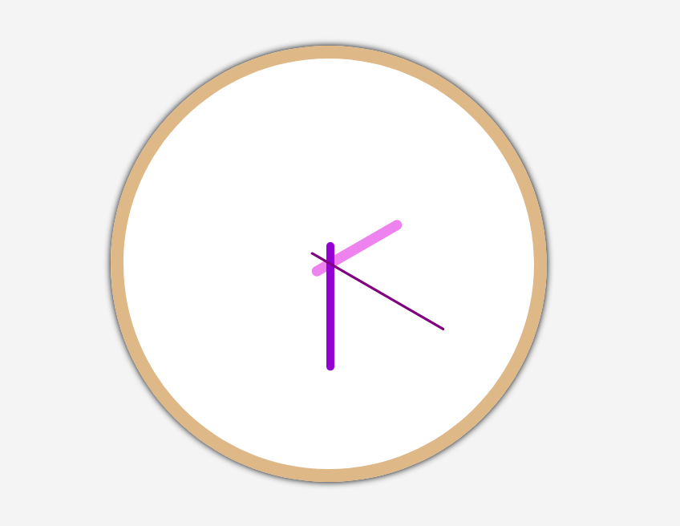

## Analog clock ( Javascript )
Simple implementation of analog clock written for web

 

### Live demo
https://accelerator-one.github.io/analog-clock-javascript/public/index.html

 

### Screenshot
